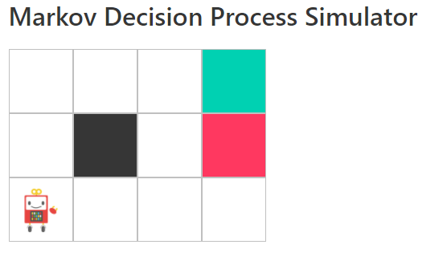
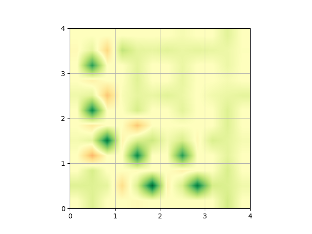

# Baby Steps of Reinforcement Learning

The step by step guide of Reinforcement Learning with Python.

## Plan before Action: Dynamic Programming

First we think "make plan before action" strategy. It is called "Dynamic Programming".

There are 2 aspect when planning.

1. Estimate the reward on the state.
   * If you know the expected reward on each state, stepping toward higher states led to maximum reward.
2. Brush up the plan.
   * Iteratively update your plan to get more reward, it will be the best plan.

1st is called `Value Iteration`, and 2nd is called `Policy Iteration`.  
This "From the value or policy?" aspect is key point in RL.

Let's experience Dynamic Programming by the cute simulator, and understand its theory from the simple code!

## Make Plan from Experience

If the number of states is so huge or transition between these is complicated, "planning" cost is high.  
So we have to think the strategy that beginning with action then modifies the plan.

There are 3 point to utilize the experience.

1. How much experience should we accumulate?
   * We don't know the detail of environment.
   * Therefore there are probabilities that more good reward is in states that are not discovered.
   * How much experience is "enough" for planning?
2. How long experience should we learn from?
   * Only one action? or actions until the end of episode?
3. Which do experiences update value or policy?
   * From the value update aspect, future actions are assumed to select under the optimized policy (in short, optimistic).
   * From the policy update aspect, future actions are selected by its own policy (realistic).

Above problems are linked to representative methods or concept in RL.

1. Epsilon & Greedy method
2. TD learning or Monte Carlo
3. Off policy or On policy

And of corse thre is the aspect of "value or policy".

In the examples, following methods are introduced to show the difference of above points.

1. How much experience should we accumulate?
   * [Epsilon & Greedy method](https://github.com/icoxfog417/baby-steps-of-rl/blob/master/EL/notebooks/Epsilon%26Greedy.ipynb)
2. How long experience should we learn from?
   * From one action (=TD): [SARSA](https://github.com/icoxfog417/baby-steps-of-rl/blob/master/EL/notebooks/SARSA.ipynb)
   * From episode: [Monte Carlo](https://github.com/icoxfog417/baby-steps-of-rl/blob/master/EL/notebooks/Monte%20Carlo.ipynb)
3. Which do experiences update value or policy?
   * From the value update aspect (Off-policy): [Q-learning](https://github.com/icoxfog417/baby-steps-of-rl/blob/master/EL/notebooks/Q-learning.ipynb)
   * From the policy update aspect (On-policy): SARSA
   * Both of them! : [Actor & Critic](https://github.com/icoxfog417/baby-steps-of-rl/blob/master/EL/notebooks/Actor%26Critic.ipynb)

To evaluate each method, [Frozen Lake](https://gym.openai.com/envs/FrozenLake-v0/) is used.  
Each cell represents the state, and North, South, East and West in it shows the estimated reward of each action (`Q[s][a]`).

(default frozen lake is slippy and it is hard to solve without parameter/reward tuning, so the `is_slippery=False` environment used.)

**contents comming soon...**

Another topics will come

* Reinforcement Learning meets Deep Learning
* How to solve the game with Deep RL
* Try & Understand recent Deep RL algorithm
