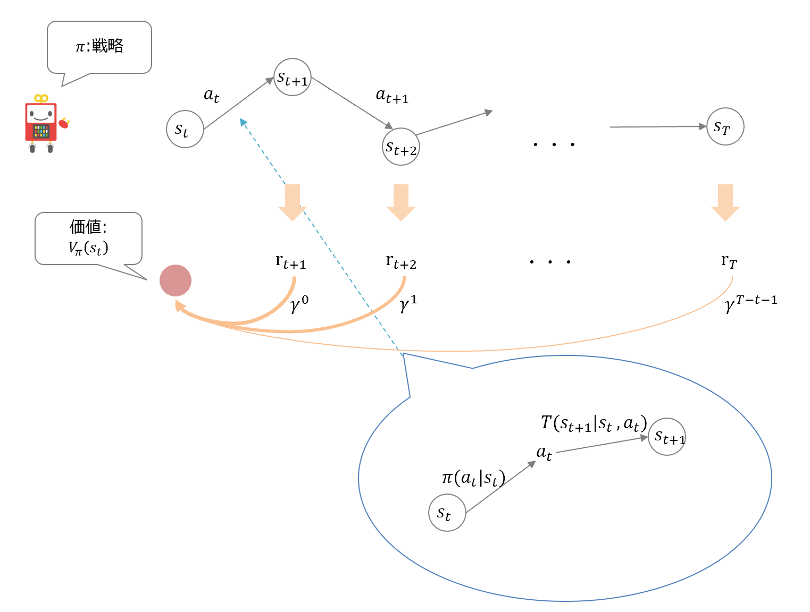

# Pythonで学ぶ強化学習 -入門から実践まで-

[Pythonで学ぶ強化学習 -入門から実践まで-]()の実装コードリポジトリです。

## Index

* [Day1: 強化学習の基礎](https://github.com/icoxfog417/baby-steps-of-rl-ja#day1-%E5%BC%B7%E5%8C%96%E5%AD%A6%E7%BF%92%E3%81%AE%E5%9F%BA%E7%A4%8E)
* [Day2: 強化学習の解法(1): 環境から計画を立てる](https://github.com/icoxfog417/baby-steps-of-rl-ja#day2-%E5%BC%B7%E5%8C%96%E5%AD%A6%E7%BF%92%E3%81%AE%E8%A7%A3%E6%B3%951-%E7%92%B0%E5%A2%83%E3%81%8B%E3%82%89%E8%A8%88%E7%94%BB%E3%82%92%E7%AB%8B%E3%81%A6%E3%82%8B)
* [Day3: 強化学習の解法(2): 経験から計画を立てる](https://github.com/icoxfog417/baby-steps-of-rl-ja#day3-%E5%BC%B7%E5%8C%96%E5%AD%A6%E7%BF%92%E3%81%AE%E8%A7%A3%E6%B3%952-%E7%B5%8C%E9%A8%93%E3%81%8B%E3%82%89%E8%A8%88%E7%94%BB%E3%82%92%E7%AB%8B%E3%81%A6%E3%82%8B)
* [Day4: 強化学習に対するニューラルネットワークの適用](https://github.com/icoxfog417/baby-steps-of-rl-ja#day4-%E5%BC%B7%E5%8C%96%E5%AD%A6%E7%BF%92%E3%81%AB%E5%AF%BE%E3%81%99%E3%82%8B%E3%83%8B%E3%83%A5%E3%83%BC%E3%83%A9%E3%83%AB%E3%83%8D%E3%83%83%E3%83%88%E3%83%AF%E3%83%BC%E3%82%AF%E3%81%AE%E9%81%A9%E7%94%A8)
* [Day5: 深層強化学習の弱点](https://github.com/icoxfog417/baby-steps-of-rl-ja#day5-%E6%B7%B1%E5%B1%A4%E5%BC%B7%E5%8C%96%E5%AD%A6%E7%BF%92%E3%81%AE%E5%BC%B1%E7%82%B9)
* [Day6: 強化学習の弱点を克服するための手法](https://github.com/icoxfog417/baby-steps-of-rl-ja#day6-%E5%BC%B7%E5%8C%96%E5%AD%A6%E7%BF%92%E3%81%AE%E5%BC%B1%E7%82%B9%E3%82%92%E5%85%8B%E6%9C%8D%E3%81%99%E3%82%8B%E3%81%9F%E3%82%81%E3%81%AE%E6%89%8B%E6%B3%95)
* [Day7: 強化学習の活用領域](https://github.com/icoxfog417/baby-steps-of-rl-ja#day7-%E5%BC%B7%E5%8C%96%E5%AD%A6%E7%BF%92%E3%81%AE%E6%B4%BB%E7%94%A8%E9%A0%98%E5%9F%9F)

[Setup](https://github.com/icoxfog417/baby-steps-of-rl-ja#setup)

[Support Content](https://github.com/icoxfog417/baby-steps-of-rl-ja#support-content)

### Day1: 強化学習の基礎

Day1の実装では、強化学習が前提とする問題設定である「マルコフ決定過程(Markov Decision Process: MDP)」の仕組みについて学びます。


* [MDPの実装](https://github.com/icoxfog417/baby-steps-of-rl-ja/blob/master/DP/environment.py)

### Day2: 強化学習の解法(1): 環境から計画を立てる

Day2では、MDPの環境を実際に解いてみます。まず、行動の指針となる「価値」を定義します。その後に、「動的計画法(Dynamic Programming: DP)」を用いて環境を解いてみます。動的計画法はモデルベースと呼ばれる手法の一種で、モデル(=環境の遷移関数と報酬関数)から行動計画を作成します。



* [価値の定義: Bellman Equation](https://github.com/icoxfog417/baby-steps-of-rl-ja/blob/master/DP/bellman_equation.py)
* [価値反復法(Value Iteration)、戦略反復法(Policy Iteration)](https://github.com/icoxfog417/baby-steps-of-rl-ja/blob/master/DP/planner.py)

価値反復法、戦略反復法について実行結果を試せるシミュレーターを用意しています。以下のスクリプトを実行し、立ち上がったサーバーにアクセスしてみてください。

```
python DP/run_server.py
```

http://localhost:8888/


パラメーターを変えながら実行することで、計算の過程を確認してみてください。

### Day3: 強化学習の解法(2): 経験から計画を立てる

Day3では経験から計画を立てる方法を学びます。経験から計画を立てる際は、3つの観点がありました。

* 経験の蓄積と活用のバランス
  * [Epsilon-Greedy法](https://github.com/icoxfog417/baby-steps-of-rl-ja/blob/master/EL/notebooks/Epsilon%26Greedy.ipynb)
* 実績から計画を修正するか、予測で行うか
  * [Monte Carlo](https://github.com/icoxfog417/baby-steps-of-rl-ja/blob/master/EL/notebooks/Monte%20Carlo.ipynb)
  * [Temporal Difference](https://github.com/icoxfog417/baby-steps-of-rl-ja/blob/master/EL/notebooks/Q-learning.ipynb)
* 経験を状態評価、戦略どちらの更新に利用するか
  * [On policy: SARSA](https://github.com/icoxfog417/baby-steps-of-rl-ja/blob/master/EL/notebooks/SARSA.ipynb)
  * [Off policy: Q-learning](https://github.com/icoxfog417/baby-steps-of-rl-ja/blob/master/EL/notebooks/Q-learning.ipynb)
  * [Actor Critic](https://github.com/icoxfog417/baby-steps-of-rl-ja/blob/master/EL/notebooks/Actor%26Critic.ipynb)

「経験」とは、具体的には見積もった価値と実際の価値との差異でした。この差異(=誤差)を小さくすることが学習の本質となります。


### Day4: 強化学習に対するニューラルネットワークの適用

Day4では、強化学習をパラメーターを持った関数=ニューラルネットワークで実装する手法を学びます。Day3まで行動は状態/行動のテーブルから決定されていました(Q-Table)。Day4では状態を入力、行動や行動価値を出力とする関数で決定を行います。この関数としてニューラルネットワークを使用します。

* [ニューラルネットワークの仕組み](https://github.com/icoxfog417/baby-steps-of-rl-ja/tree/master/FN/nn_tutorial)
* [価値を関数から算出する](https://github.com/icoxfog417/baby-steps-of-rl-ja/blob/master/FN/value_function_agent.py)
  * [価値をDNNで算出する(DQN)](https://github.com/icoxfog417/baby-steps-of-rl-ja/blob/master/FN/dqn_agent.py)
* [行動を関数から決定する(戦略の関数化)](https://github.com/icoxfog417/baby-steps-of-rl-ja/blob/master/FN/policy_gradient_agent.py)
  * [戦略をDNNで算出する(A2C)](https://github.com/icoxfog417/baby-steps-of-rl-ja/blob/master/FN/a2c_agent.py)

これまでの手法、またDNN(ディープニューラルネットワーク)を利用した手法、双方を含めた手法の系統図は以下のようになっています。


### Day5: 深層強化学習の弱点

強化学習に対するDNNの適用は、良いことばかりではありません。具体的には、以下のような問題が現れます。

* サンプル効率が悪い
* 局所最適な行動に陥る、過学習することが多い
* 再現性が低い

Day4の実装では、こうした現実に対応するため、実装を工夫していました。端的には、「１回の学習結果を無駄にしない」ための工夫です。再現性が低いため何度も実験が必要ですが、サンプル効率が悪いため1回の実験に多くの時間がかかります。そのため、「1回」の実験の重みは大きく、これを無駄にしないための工夫が必要です。

具体的には、以下の対策を取っています。

* モジュール化することでテストしやすくする
* ログをしっかりとる


### Day6: 強化学習の弱点を克服するための手法

Day6では、Day5で紹介した弱点に対する根本的な対処方法(アルゴリズム的な改良)を扱います。

* サンプル効率が悪い
  * 環境/状態の学習と、そこでの行動方法の学習との分離:「環境認識の改善」
  * [モデルベースとの組み合わせ(Dyna)](https://github.com/icoxfog417/baby-steps-of-rl-ja/tree/master/MM)
* 局所最適な行動に陥る、過学習することが多い
  * 人がある程度誘導してやる: 模倣学習・逆強化学習
  * [模倣学習 (DAgger)](https://github.com/icoxfog417/baby-steps-of-rl-ja/tree/master/IM)
  * [逆強化学習](https://github.com/icoxfog417/baby-steps-of-rl-ja/tree/master/IRL)
* 再現性が低い
  * 新しい学習方法: [進化戦略](https://github.com/icoxfog417/baby-steps-of-rl-ja/tree/master/EV)

なお、サンプル効率については「環境認識の改善」以外に多くの方法があります。以下が、様々な手法をまとめたものになります。


### Day7: 強化学習の活用領域

Day7では強化学習を活用する方法を探ります。具体的には、強化学習を活用する観点を整理し、観点ごとの事例、開発を支援ツールなどをまとめています。


## Setup

セットアップには、[Miniconda](https://conda.io/miniconda.html)を使用します。その他の環境を使用する場合は、適宜読み替えを行ってください。

動作確認環境(修正中)

* Python: 3.6
* TensorFlow: 1.12.0

セットアップ手順

```
git clone https://github.com/icoxfog417/baby-steps-of-rl-ja.git
cd baby-steps-of-rl-ja
conda create -n rl-book python=3.6
activate rl-book  # Mac/Linuxの場合 source activate rl-book
```

1.	GitHubからソースコードをダウンロード
2.	ダウンロードしたソースコードのフォルダに移動
3.	ソースコード実行用の環境(仮想環境)を作成
4.	作成した仮想環境を有効化(WindowとMac/Linuxでコマンドが異なるため注意してください)
5.	リポジトリの実行に必要なライブラリをインストール

Pythonを3.6に指定しているのは、執筆時点のTensorFlowが3.7に対応していないためです。[こちらのIssue](https://github.com/tensorflow/tensorflow/issues/20517)がCloseしたら、指定は外して問題ないはずです。


## Support Content

プログラミングが初めて、という方のために参考になるコンテンツを用意しています。最近はプログラムを学ぶ書籍などは充実しているため、もちろんそれらで補完して頂いて構いません。

* Python
  * [python_exercises](https://github.com/icoxfog417/python_exercises)
* Git
  * [使い始めるGit](https://qiita.com/icoxfog417/items/617094c6f9018149f41f)
