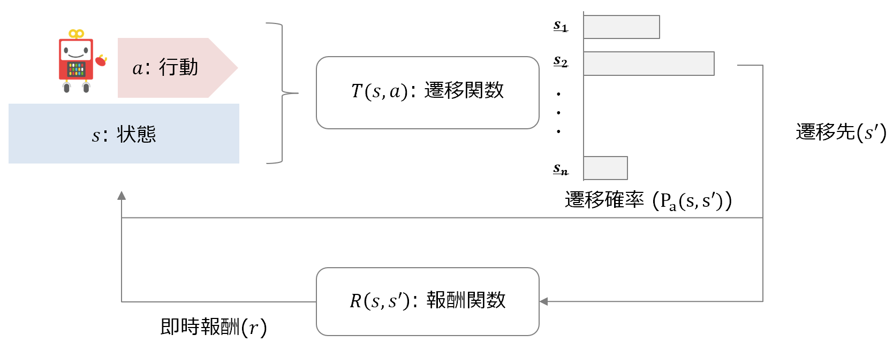
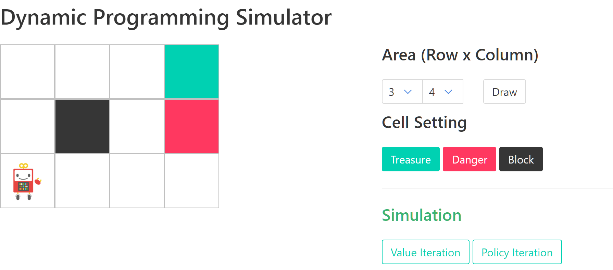
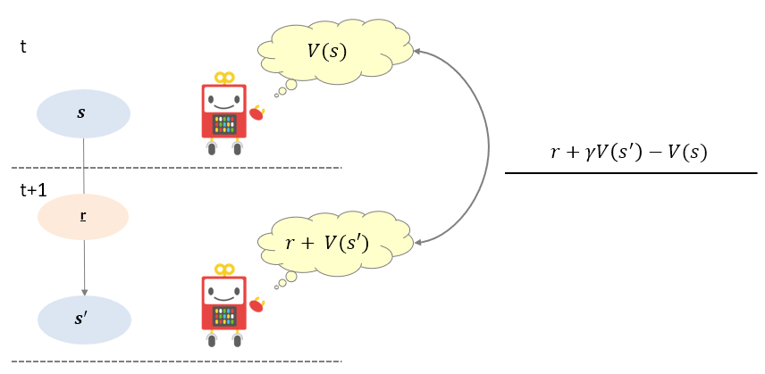
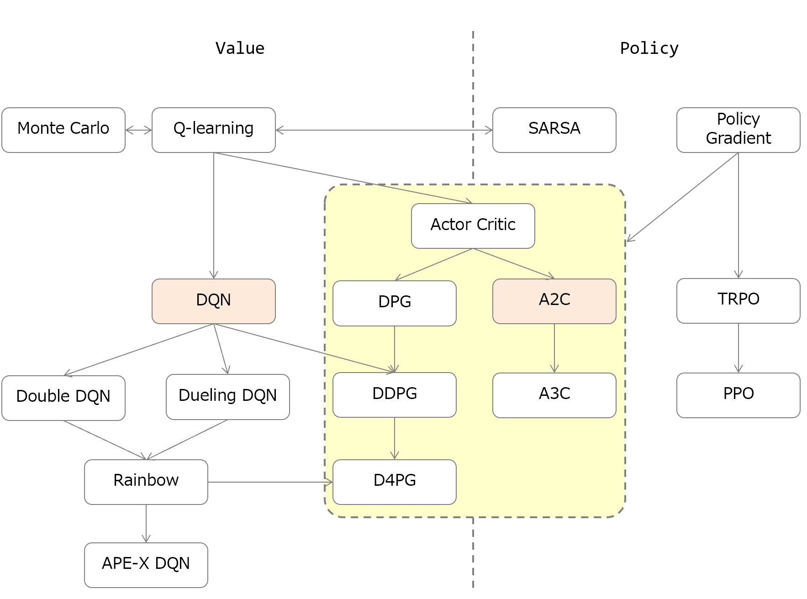
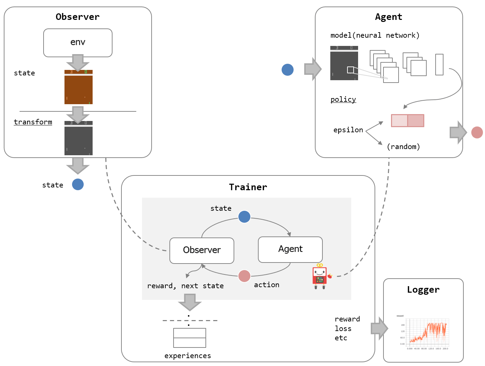
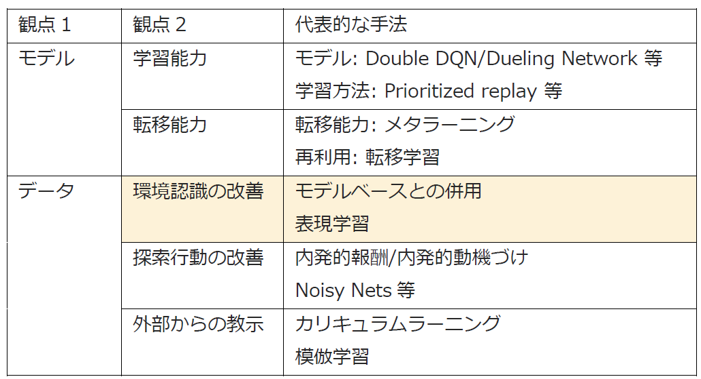
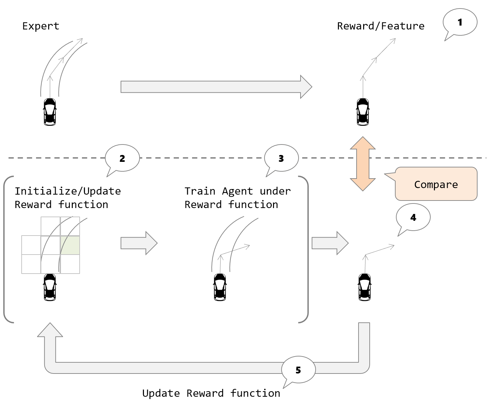
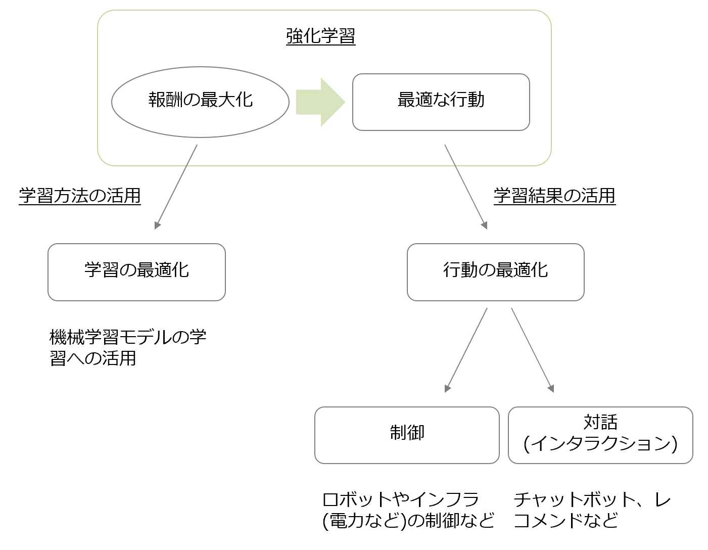

# Pythonで学ぶ強化学習 -入門から実践まで-

[Pythonで学ぶ強化学習 -入門から実践まで-](https://www.amazon.co.jp/dp/4065142989/)の実装コードリポジトリです。

誤記、またサンプルコードの実行エラーについてはIssueで管理しています。

**[Issue List](https://github.com/icoxfog417/baby-steps-of-rl-ja/issues)**

* [3版(2/4発行)での修正点](https://github.com/icoxfog417/baby-steps-of-rl-ja/milestone/1?closed=1)
  * [ソースコードの修正点](https://github.com/icoxfog417/baby-steps-of-rl-ja/pull/17/files)
* [改訂第2版での修正点](https://github.com/icoxfog417/baby-steps-of-rl-ja/milestone/2?closed=1)
  * [ソースコードの修正点](https://github.com/icoxfog417/baby-steps-of-rl-ja/pull/35/files)

誤記/表記についての指摘、またサンプルコードの実行エラーについては[Issueにて](https://github.com/icoxfog417/baby-steps-of-rl-ja/issues/new)ご連絡をお願いします。

* 既に同じIssueが上がっていないか、事前に確認をお願いします。
* 実行エラーについては、テンプレートに沿い実行環境、発生エラーについて記載をお願いします。

## Index

* [Setup](https://github.com/icoxfog417/baby-steps-of-rl-ja#setup)
  * [Setup with GPU](https://github.com/icoxfog417/baby-steps-of-rl-ja#setup-with-gpu)
* [Day1: 強化学習の位置づけを知る](https://github.com/icoxfog417/baby-steps-of-rl-ja#day1-%E5%BC%B7%E5%8C%96%E5%AD%A6%E7%BF%92%E3%81%AE%E4%BD%8D%E7%BD%AE%E3%81%A5%E3%81%91%E3%82%92%E7%9F%A5%E3%82%8B)
* [Day2: 強化学習の解法(1): 環境から計画を立てる](https://github.com/icoxfog417/baby-steps-of-rl-ja#day2-%E5%BC%B7%E5%8C%96%E5%AD%A6%E7%BF%92%E3%81%AE%E8%A7%A3%E6%B3%951-%E7%92%B0%E5%A2%83%E3%81%8B%E3%82%89%E8%A8%88%E7%94%BB%E3%82%92%E7%AB%8B%E3%81%A6%E3%82%8B)
* [Day3: 強化学習の解法(2): 経験から計画を立てる](https://github.com/icoxfog417/baby-steps-of-rl-ja#day3-%E5%BC%B7%E5%8C%96%E5%AD%A6%E7%BF%92%E3%81%AE%E8%A7%A3%E6%B3%952-%E7%B5%8C%E9%A8%93%E3%81%8B%E3%82%89%E8%A8%88%E7%94%BB%E3%82%92%E7%AB%8B%E3%81%A6%E3%82%8B)
* [Day4: 強化学習に対するニューラルネットワークの適用](https://github.com/icoxfog417/baby-steps-of-rl-ja#day4-%E5%BC%B7%E5%8C%96%E5%AD%A6%E7%BF%92%E3%81%AB%E5%AF%BE%E3%81%99%E3%82%8B%E3%83%8B%E3%83%A5%E3%83%BC%E3%83%A9%E3%83%AB%E3%83%8D%E3%83%83%E3%83%88%E3%83%AF%E3%83%BC%E3%82%AF%E3%81%AE%E9%81%A9%E7%94%A8)
* [Day5: 強化学習の弱点](https://github.com/icoxfog417/baby-steps-of-rl-ja#day5-%E5%BC%B7%E5%8C%96%E5%AD%A6%E7%BF%92%E3%81%AE%E5%BC%B1%E7%82%B9)
* [Day6: 強化学習の弱点を克服するための手法](https://github.com/icoxfog417/baby-steps-of-rl-ja#day6-%E5%BC%B7%E5%8C%96%E5%AD%A6%E7%BF%92%E3%81%AE%E5%BC%B1%E7%82%B9%E3%82%92%E5%85%8B%E6%9C%8D%E3%81%99%E3%82%8B%E3%81%9F%E3%82%81%E3%81%AE%E6%89%8B%E6%B3%95)
* [Day7: 強化学習の活用領域](https://github.com/icoxfog417/baby-steps-of-rl-ja#day7-%E5%BC%B7%E5%8C%96%E5%AD%A6%E7%BF%92%E3%81%AE%E6%B4%BB%E7%94%A8%E9%A0%98%E5%9F%9F)

[Support Content](https://github.com/icoxfog417/baby-steps-of-rl-ja#support-content)  

## Setup

サンプルコードをダウンロードするのにGit、実行をするのにPythonの環境が必要です。そのため、以下2つのソフトウェアをダウンロードし、インストールしてください。なお、本書ではPythonの環境を作成するのにMinicondaを使用します。

1. [Git](https://git-scm.com/)
2. [Python (Miniconda)](https://conda.io/miniconda.html)
   * ダウンロードするのは、Python3の方です

インストールが終了したら、まずソースコードのダウンロードを行います。ターミナル/コマンドプロンプトを開き、作業するディレクトリで以下のコマンドを実行してください。

```
git clone https://github.com/icoxfog417/baby-steps-of-rl-ja.git
```

コマンドを実行すると、`baby-steps-of-rl-ja`というディレクトリが作成されていると思います。これで、ダウンロードは完了しました。ダウンロードしたフォルダに移動しましょう。

```
cd baby-steps-of-rl-ja
```

続いて、ソースコードの実行環境を作成します。実行環境を作成するのに、Minicondaをインストールすることで使えるようになる`conda`コマンドを使用します。これから、本書の実行環境である`rl-book`という環境を作成します。

```
conda create -n rl-book python=3.6
conda activate rl-book
```

`conda activate`を実行することで、ターミナルの先頭に`(rl-book)`がついたでしょうか。これが、実行環境が有効化されているサインです。本書のソースコードを実行する際は、まず実行環境が有効化されているか=`(rl-book)`が先頭についているか、を確認してください。なお、無効化する際は`conda deactivate`のコマンドを実行します。

実行環境に、実行に必要なライブラリをインストールします(`(rl-book)`が先頭についているか確認して実行してください)。

```
pip install -r requirements.txt
```

以下のように、`welcome.py`を実行してみてください。ゲーム画面が立ち上がればセットアップは完了です。

```
python welcome.py
```

## Setup with GPU

Day4で深層学習を利用した強化学習を実装していますが(DQN/A2C)、この学習にはGPUが不可欠です。GPUがない場合、学習に数日はかかります。

GPUを利用した学習には、当然GPUが必要です(より具体的には、NVIDIAのGPUです)。GPUを調達する方法は、以下2つです。

1. GPUを搭載したマシンを用意する
2. クラウド上でGPUを利用する
    * クラウドプラットフォームのGPUインスタンスを利用する
    * Google ColaboratoryでGPUを利用する

### Local GPU Machine Setup

GPUを搭載したマシンがある場合、以下3つのステップでセットアップを行います。

1. NVIDIA Driverのダウンロードとインストール
    * [NVIDIAドライバダウンロード](https://www.nvidia.co.jp/Download/index.aspx?lang=jp)
    * 基本的には、自動でダウンロードすべきドライバを選んでくれます。選んでくれない場合、手動で選択してダウンロードします。
2. CUDA Toolkitのインストール
    * [CUDA Toolkit Archive](https://developer.nvidia.com/cuda-toolkit-archive)から、使用するTensorFlowが対応しているバージョンをダウンロードしインストールします([TensorFlow 1.13以上はCUDA 10です](https://www.tensorflow.org/install/gpu))。
3. cuDNNのインストール
    * [cuDNN](https://developer.nvidia.com/cudnn)をダウンロードし、Toolkitのフォルダに展開します。なお、cuDNNのダウンロードにはユーザー登録が必要です。
4. `tensorflow`の代わりに、`tensorflow-gpu`をインストールします(`tensorflow`がインストールされている場合、アンインストールしてください)。

`import tensorflow as tf`を実行し何もエラーがでなければセットアップは完了です。

```
> python
>>>  import tensorflow as tf
```

### Cloud GPU Machine Setup

AWSやAzure、GCPではGPUインスタンスを提供しています。それらを使用すれば、GPU搭載マシンを用意する必要はありません。GPUインスタンスでのセットアップ手順は[Local GPU Machine Setup](https://github.com/icoxfog417/baby-steps-of-rl-ja#local-gpu-machine-setup)と同じです。セットアップ済みのインスタンス(SageMakerなど)の場合、セットアップの必要もありません。

GPUインスタンスの使用には当然料金がかかります。そこで、無料でGPUを使用した計算ができるGoogle Colaboratoryを紹介します。

* [Day4: 価値評価に深層学習を適用する: Deep Q-Network](https://colab.research.google.com/drive/1QZs38jqCaSIpoKmoIl8XxVJUwdG78Hb8)
* [Day4: 戦略に深層学習を適用する: Advantage Actor Critic(A2C)](https://colab.research.google.com/drive/1IzXGuNj4ZbsuWC7ei98ZzKrVk7mPS1t-)

Google Colaboratoryは、オンライン上でJupyter Notebookが使えるサービスです。GPUを使った計算も行うことができます。ただ、実行時間が限られています。長期の実行は行えませんが、可能な範囲で学習してモデルをダウンロードするには十分使えます。


## Day1: 強化学習の位置づけを知る

**Day1's Goals**

* 強化学習と、機械学習、人工知能といったキーワードの関係を理解する
* 強化学習以外の学習法に対する、強化学習のメリット・デメリットを理解する
* 機械学習の基本的な仕組みを理解する

**Summary**

* 強化学習とは?
  * 強化学習 ⊂ 機械学習 ⊂ 人工知能。
  * 機械学習 = 「機械」(=モデル)を「学習」させる手法。
  * 強化学習 = 「学習」方法の一種。
  * 強化学習は、連続した行動を通じて獲得できる「報酬の総和」を最大化することを目的とする。
  * 行動の評価方法と、(評価に基づく)行動の選び方(=戦略)を学習する。
* 強化学習のメリット・デメリット
  * メリット: 評価が難しいタスクでも扱うことができる(行動の評価方法を学習するため)。
  * デメリット: どんな行動を学習するかは制御できない(モデルが自ら獲得するため)。
* 強化学習の基本的な仕組み
  * 強化学習では、与えられる「環境」が一定のルールに従っていることを仮定する。
  * このルールを、 **マルコフ決定過程(Markov Decision Process: MDP)** という。
  * MDPの構成要素とその関係は、以下のように図式化できる。
  * MDPにおける報酬は、「直前の状態と遷移先」に依存する。
  * この報酬を **即時報酬(Immediate reward)** という。
  * 報酬の総和(=即時報酬の合計)は、当然事前には知ることができない。
  * そのため見積りを行うが、見積もった値を **期待報酬(Expected reward)** 、また **価値(Value)** と呼ぶ。
  * 見積もる際に、将来の即時報酬については割り引いて考える。
  * 割り引くための係数を **割引率(discount factor)** と呼ぶ。

<p align="center">
  
  <p align="center">MDPの構成要素とその関係</p>
</p>

**Exercises**

* [MDPの実装](https://github.com/icoxfog417/baby-steps-of-rl-ja/blob/master/DP/environment.py)

## Day2: 強化学習の解法(1): 環境から計画を立てる

**Day2's Goals**

* 行動評価の指標となる「価値」の定義を理解する
* 状態の「価値」を動的計画法で学習する手法と実装方法を理解する
* 「戦略」を動的計画法で学習する手法と実装方法を理解する
* モデルベースの手法とモデルフリーの手法の違いを理解する

**Summary**

* 「価値」の定義
  * Day1で定義した「価値」の計算には、将来の時点の即時報酬が必要になる。
  * 将来の即時報酬は、計算する段階では当然わからない。
  * わからない値に関する計算を持ち越しできるように、式を再帰的に定義する。
  * 発生しうる即時報酬の候補はいくつかあり、どれになるかは確率的になる。
  * そのため、報酬の値は期待値(確率x値)で表すようにする(行動確率 x 即時報酬)。
  * 「価値」を再帰的かつ期待値で計算した式を、 **Bellman Equation** と呼ぶ。
* 状態の「価値」の学習と、「戦略」の学習
  * **Bellman Equation** では期待値の計算に戦略(行動確率)を使用する。
  * 期待値(価値)が計算されれば、それに基づき戦略の修正も行われる(得られる価値が高くなるよう修正する)。
  * 価値の計算、戦略の更新、価値の再計算・・・という処理が繰り返されることになる。
  * 動的計画法において、戦略と価値を相互に更新するプロセスを **Policy Iteration** と呼ぶ。
  * 一方、価値が計算できるなら価値が一番高いところを選べばいい、という素朴な考えもある。
  * この場合、価値=戦略となる。
  * 動的計画法において、価値=戦略とし、価値のみ更新するプロセスを **Value Iteration** と呼ぶ。
  * 戦略を持つか(Policyベース)、価値=戦略とするか(Valueベース)は、強化学習において重要な観点となる。
* モデルベースとモデルフリー。
  * 動的計画法では、エージェントを一切動かさずに戦略/価値を学習した。
  * このような芸当が可能なのは、遷移関数と報酬関数が明らかであり、シミュレーションが可能であるため。
  * こうした、環境の情報を元に学習する手法を **モデルベース** の手法と呼ぶ。
  * なお、遷移関数と報酬関数がわかっていることは少ないため、実際は推定を行うことになる。
  * 一方、実際にエージェントを動かすことで得られた経験を元に学習する方法を **モデルフリー** の手法と呼ぶ。
  * モデルの情報(遷移関数/報酬関数)が必要ないため、モデル「フリー」と呼ばれる。
  * 環境が高度になるほどモデルの推定が困難になるため、一般的にはモデルフリーが用いられることが多い。
  * しかし、表現力の高いDNNの登場によりこの限りではなくなっている。
  * また、モデルフリーとモデルベースを併用する試みも多く行われている。

**Exercises**

* [価値の定義: Bellman Equationの実装](https://github.com/icoxfog417/baby-steps-of-rl-ja/blob/master/DP/bellman_equation.py)
* [価値反復法(Value Iteration)、戦略反復法(Policy Iteration)の実装](https://github.com/icoxfog417/baby-steps-of-rl-ja/blob/master/DP/planner.py)

Value Iteration/Policy Iterationについて実行結果を試せるシミュレーターを用意しています。  
以下のスクリプトを実行し、立ち上がったサーバーにアクセスしてみてください([こちらから試せます](https://baby-step-of-rl-ja-dp.herokuapp.com/))。

```
python DP/run_server.py
```

http://localhost:8888/



* Areaで行・列を指定し、Drawのボタンを押すことで指定したサイズの迷路を作成できる。
* 迷路内のセルを選択した後、Cell Settingのボタンを押すことで迷路のマスの設定を行うことができる。
* Treasureはプラスの、Dangerはマイナスの報酬のゴール。Blockは、移動できないセルとなる。
* 迷路の設定ができたら、Simulationにあるボタンを押し計画を立てる。
* Value Iteration/Policy Iterationどちらかのボタンを押すと、ボタンに応じたアルゴリズムで解いた結果が参照できる。

## Day3: 強化学習の解法(2): 経験から計画を立てる

**Day3's Goals**

* 経験を活用する際の3つの観点を理解する
   1. 経験の蓄積と活用のバランス
   2. 計画の修正を実績から行うか、予測で行うか
   3. 経験を価値、戦略どちらの更新に利用するか
* 各観点における対の関係を理解する
* 各観点を代表する手法の実装方法を身につける

**Summary**

* 「経験」とは
  * 「行動する前」に見積もった価値と、「行動した後」判明した実際の価値との差異となる。
  * 行動すればするほど実際の即時報酬が明らかになり、見積もりに依存する分は少なくなる。
  * これは「行動する前」の時点と「行動した後」の時点の差、という時刻間の差とも言える。
  * そのため、これを **TD誤差(Temporal Difference error)** と呼ぶ。

<p align="center">
  
  <p align="center">経験=TD誤差</p>
</p>

* 経験の蓄積と活用のバランス
  * モデルフリーでは遷移関数/報酬関数が不明である。
  * そのため、「経験」の信頼度を上げるには複数回の試行が必要になる。
  * (宝くじを1回買って当選したから、宝くじの当選確率は100%!とはならない)。
  * 行動回数は。通常限られている。
  * そのため、行動回数を「経験の信頼度向上」(見積り精度向上)と「経験を信じた行動」に割り振る必要がある。
  * これを **探索と活用のトレードオフ(Exploration-Exploitation Trade-off)** と呼ぶ。
  * (探索=信頼度向上、活用=信じた行動)。
  * Epsilonの確率で探索/活用を切り替える手法を、**Epsilon-Greedy法** と呼ぶ。
* 計画の修正を実績から行うか、予測で行うか
  * 「行動した後」は、最短では1回行動した後、最長ではエピソードが終了した後となる。
  * 前者を **TD法(TD(0))** 、後者を **Monte Carlo法** と呼ぶ。
  * 「行動した後」を長く取るほど実績に基づいた修正が可能になるが、その分修正のタイミングは遅くなる。
  * 実績/タイミングどちらを取るかはトレードオフとなる。
  * TD(0)とMonte Carlo法の間を取ることももちろん可能である。
  * 「行動した後」を複数ステップ後にする手法を **Multi-step learning** と呼ぶ。
  * ステップ数の異なる経験を組み合わせる手法を **TD(λ)法** と呼ぶ。
* 経験を価値、戦略どちらの更新に利用するか
  * 経験は、価値/戦略(Valueベース/Policyベース)どちらの更新にも利用可能である。
  * TD法に基づき行動の価値の更新を行う手法を **Q-learning** と呼ぶ。
  * ("Q"は、行動価値を表す記号としてよく用いられる。これに対し状態の価値は"V"とされることが多い)。
  * TD法に基づき戦略の更新を行う手法を **SARSA(State–action–reward–state–action)** と呼ぶ。
  * SARSAでは価値を見積る際、先の行動は戦略により決定されることを前提とする。この前提を **On-policy** と呼ぶ。
  * Valueベースのように、先の行動は「最大の価値が得られる行動」である、とする場合を **Off-policy** と呼ぶ。
  * (戦略がない=Offのためこう呼ばれる)。
  * Q-learningはOff-policyであり、SARSAはOn-policyである。
  * SARSAでは戦略評価と戦略に同じ"Q"を使用している。
  * これに対し、Policy Iterationのように評価と戦略を切り離すこともできる。
  * 戦略側をActor、評価側をCriticとして切り離した手法を **Actor-Critic** と呼ぶ。
  * Actor-Criticは、Policyベース(Actor)とValueベース(Critic)の併用とも言える。

修正方法(実績/予測)、修正対象(価値/戦略)、見積り前提(On-policy/Off-policy)の3つの観点で手法をまとめると、以下のようになる。

<table>
  <tr>
    <th rowspan="2"></th>
    <th colspan="2">修正方法</th>
    <th colspan="2">修正対象</th>
    <th colspan="2">見積り前提</th>
  </tr>
  <tr>
    <td>予測</td>
    <td>実績</td>
    <td>価値</td>
    <td>戦略<br></td>
    <td>Off-policy</td>
    <td>On-policy</td>
  </tr>
  <tr>
    <td>Q-learning</td>
    <td>○</td>
    <td></td>
    <td>○</td>
    <td></td>
    <td>○</td>
    <td></td>
  </tr>
  <tr>
    <td>Monte Carlo</td>
    <td></td>
    <td>○</td>
    <td>○</td>
    <td></td>
    <td>○</td>
    <td></td>
  </tr>
  <tr>
    <td>SARSA</td>
    <td>○</td>
    <td></td>
    <td colspan="2" align="center">○</td>
    <td></td>
    <td>○</td>
  </tr>
  <tr>
    <td>Actor Critic</td>
    <td>○</td>
    <td></td>
    <td>○</td>
    <td>○</td>
    <td></td>
    <td>○</td>
  </tr>
  <tr>
    <td>Off-policy Actor Critic</td>
    <td>○</td>
    <td></td>
    <td>○</td>
    <td>○</td>
    <td>○</td>
    <td></td>
  </tr>
  <tr>
    <td>On-policy Monte Carlo</td>
    <td></td>
    <td>○</td>
    <td>○</td>
    <td>○</td>
    <td></td>
    <td>○</td>
  </tr>
  <tr>
    <td>Off-policy Monte Carlo</td>
    <td></td>
    <td>○</td>
    <td>○</td>
    <td>○</td>
    <td>○</td>
    <td></td>
  </tr>
</table>

**Exercises**

* 経験の蓄積と活用のバランス
  * [Epsilon-Greedy法](https://github.com/icoxfog417/baby-steps-of-rl-ja/blob/master/EL/notebooks/Epsilon%26Greedy.ipynb)
* 実績から計画を修正するか、予測で行うか
  * [Monte Carlo](https://github.com/icoxfog417/baby-steps-of-rl-ja/blob/master/EL/notebooks/Monte%20Carlo.ipynb)
  * [Temporal Difference](https://github.com/icoxfog417/baby-steps-of-rl-ja/blob/master/EL/notebooks/Q-learning.ipynb)
* 経験を価値、戦略どちらの更新に利用するか
  * [Valueベース & Off policy: Q-learning](https://github.com/icoxfog417/baby-steps-of-rl-ja/blob/master/EL/notebooks/Q-learning.ipynb)
  * [Policyベース & On policy: SARSA](https://github.com/icoxfog417/baby-steps-of-rl-ja/blob/master/EL/notebooks/SARSA.ipynb)
  * [Valueベース & Policyベース: Actor Critic](https://github.com/icoxfog417/baby-steps-of-rl-ja/blob/master/EL/notebooks/Actor%26Critic.ipynb)

## Day4: 強化学習に対するニューラルネットワークの適用

**Day4's Goals**

* 関数として、ニューラルネットワークを適用するメリット
* 価値評価を、パラメーターを持った関数で実装する方法
* 戦略を、パラメーターを持った関数で実装する方法

**Summary**

* 価値評価/戦略の関数化
  * Day3までは、状態における行動の価値をQ[s][a]というテーブルで管理してきた。
  * しかし、このままでは状態数/行動数が多くなった場合に破綻することは目に見えている。
  * テーブルを関数化することが、この組み合わせ爆発に対応するための一つの解法となる。
  * 関数として(ディープ)ニューラルネットワークを使用する強化学習を特に「深層強化学習」と呼ぶ。
* 関数として、ニューラルネットワークを使用するメリット・デメリット
  * 人間が実際に観測している「状態」に近いデータをエージェントの学習に使用できる。
  * これは、DNNが特徴抽出に優れているためである(画像ならばCNNなど)。
  * ただ、ニューラルネットワークを使うことで学習時間が長くなるなどのデメリットも発生する(詳細は[Day5](https://github.com/icoxfog417/baby-steps-of-rl-ja#day5-%E5%BC%B7%E5%8C%96%E5%AD%A6%E7%BF%92%E3%81%AE%E5%BC%B1%E7%82%B9))。
* 価値評価を、パラメーターを持った関数で実装する
  * 状態を受け取り、行動価値(=Q)を出力する関数(Q-function)を、ニューラルネットワークで実装する。
  * ニューラルネットワークとしてCNNを利用する実装を、**Deep Q-Network (DQN)** と呼ぶ。
  * DQN以前にもニューラルネットワークを使用した研究はあった。しかし、学習が安定しないという課題があった。
  * DQNは、学習を安定させる3つの工夫を行うことでこの課題を克服している。
  * 3つとは、 **Experience Reply** 、**Fixed Target Q-Network** 、**報酬のClipping** である。
  * [Rainbow](https://arxiv.org/abs/1710.02298)は、DQNに対しさらに6つの工夫を追加した手法となっている。
* 戦略を、パラメーターを持った関数で実装する
  * 戦略の出力は行動確率であり、これは価値のように事前/事後の差分で評価ができない。
  * (AとBの選択を行う際、選んだAが思っていたのとどれくらい違うかは評価できる(差分評価))。
  * (しかし、Bをとっていたらどうだったのか?というのは時間を巻き戻さないとわからない)。
  * そのため、価値の時のように差分を小さくするのではなく、純粋に戦略によって得られる期待価値を最大化する。
  * 期待値は確率X値で計算できた。
  * 戦略の期待価値は、「状態への遷移確率」X「行動確率」X「行動で得られる価値」で計算できる(J(θ))。
  * この期待価値を、勾配法で最大化する。この手法を **方策勾配法(Policy Gradient)** と呼ぶ。
  * 「行動で得られる価値」は、Day3で学んだように予測で見積る/実績から計算など様々なバリエーションがある。
  * 行動の価値から状態の価値をマイナスした、純粋な行動の価値分を **Advantage** と呼ぶ。
  * Advantageは、行動の価値は実績(Monte Carlo)、状態の価値は予測(TD)からと計算することができる。
  * 状態の価値はCritic、戦略はActorとし、Advantageを使い学習する手法を **Advantage Actor Critic (A2C)** と呼ぶ。
  * 方策勾配法は「現在の戦略での経験」で更新を行うため、過去の経験を使うExperience Replyは使用できない。
  * 方策勾配法は、勾配の更新方法がとてもデリケートである。
  * そのため、あまり大幅な更新が起きないよう(徐々に)学習させる手法としてTRPO、PPOがある。
* 価値評価か、戦略か
  * 価値評価には2つデメリットがある。
  * 1. 価値の値が拮抗している2つの行動があっても、「最大」(少しでも大きい方)しかとらない。
  * 2. 行動数が増えた場合対応が難しい。
  * 戦略の場合、価値の大きさに応じた確率を割り振る、行動数が増えた(連続の場合)でも対応が可能である。
  * (A2Cでは行動それぞれの確率を出力しており、実質的には価値評価と同じだった。これを克服する手法が2つある)。
  * 1. 価値評価のようにベストな行動一つを出力する手法(Deterministic=決定的 なPolicy Gradient= **DPG**)
  * 2. 行動分布のパラメーター(平均・分散など)を出力する手法。
  * ただ、戦略の学習は価値評価の学習に比べ安定しない傾向がある。
  * 2018年時点では、Policy Gradientの学習が意図した通りに行われているのかについてもまだよくわかっていない。
  * 既存の手法は、以下のように分類を行うことができる。

<p align="center">
  
  <p align="center">強化学習の手法の分類</p>
</p>

**Exercises**

* [ニューラルネットワークの仕組み](https://github.com/icoxfog417/baby-steps-of-rl-ja/tree/master/FN/nn_tutorial)
* [価値関数をニューラルネットで実装する](https://github.com/icoxfog417/baby-steps-of-rl-ja/blob/master/FN/value_function_agent.py)
  * [価値関数をDNNで実装する: DQN](https://github.com/icoxfog417/baby-steps-of-rl-ja/blob/master/FN/dqn_agent.py)
* [戦略をニューラルネットで実装する: Policy Gradient](https://github.com/icoxfog417/baby-steps-of-rl-ja/blob/master/FN/policy_gradient_agent.py)
  * [戦略をDNNで実装する: A2C](https://github.com/icoxfog417/baby-steps-of-rl-ja/blob/master/FN/a2c_agent.py)

## Day5: 強化学習の弱点

**Day5's goals**

強化学習、特にニューラルネットワークを利用した深層強化学習の弱点について解説する。弱点とは、以下3点である。

* サンプル効率が悪い
* 局所最適な行動に陥る、過学習することが多い
* 再現性が低い

**Summary**

* サンプル効率が悪い
  * Rainbowの論文には、Atariのゲームで人間同等のスコアを記録するのにどれぐらいの学習が必要か書かれている。
  * これによれば、Rainbowであっても、約166時間のプレイ時間が必要になる(30fpsの場合)。
* 局所最適な行動に陥る、過学習することが多い
  * 局所最適: 対戦ゲームの場合、特定の対戦相手にだけ勝てる方法を学習する。
  * 過学習: ゲームで言うところのチートプレイなどを学習する。
  * ・・・といったことが起こる場合がある。
* 再現性が低い
  * ハイパーパラメーターの設定はもちろん、実行のたびに結果が変わるようなケースがある。
* 対策
  * 根本的な対策は[Day6](https://github.com/icoxfog417/baby-steps-of-rl-ja#day6-%E5%BC%B7%E5%8C%96%E5%AD%A6%E7%BF%92%E3%81%AE%E5%BC%B1%E7%82%B9%E3%82%92%E5%85%8B%E6%9C%8D%E3%81%99%E3%82%8B%E3%81%9F%E3%82%81%E3%81%AE%E6%89%8B%E6%B3%95)にて紹介し、Day5ではこの弱点を前提とした対策を紹介する。
  * 対策の基本は、「１回の学習結果を無駄にしない」となる。
  * 「再現性が低い」ため複数回の実験が必要になる。
  * しかし、「サンプル効率が悪い」ため学習には多くの時間が必要となる。
  * そのため、一回の実験は長時間X複数回の実行からなる。これには当然時間がかかる。
  * 時間のかかる実験がつまらないミスでやり直しになる事態を、可能な限り避ける必要がある。
  * また、一回の実験からは可能な限り情報を取りたい。
  * これを実現するため、Day4以降の実装では「モジュール分割」と「ログ取得」の2つを行っている。

<p align="center">
  
  <p align="center">強化学習の実装フレームワーク</p>
</p>

## Day6: 強化学習の弱点を克服するための手法

**Day6's goals**

Day6では、Day5で紹介した弱点に対する根本的な対処方法(アルゴリズム的な改良)を解説する。

* 「サンプル効率が悪い」ことへの対処法
* 「再現性が低い」ことへの対処法
* 「局所最適な行動に陥る、過学習することが多い」ことへの対処法

**Summary**

* 「サンプル効率が悪い」ことへの対処法
  * 強化学習におけるサンプル効率の改善については、様々な手法が提案されている(下表参照)。
  * 本書では、そのうちの一つである「環境認識の改善」について扱う。
  * 深層強化学習は、画面など(人間が受け取るような)生に近いデータを扱う。
  * このため、モデルは「入力(画面)からの特徴抽出」と「行動の仕方」の2つを同時に学習する必要がある。
  * これが、学習効率を下げている原因と考えることができる。
  * 「環境認識の改善」では、環境からの情報取得のサポートを行う。これには2つの方法がある。
  * モデルベースとの併用: 環境のシミュレーター(モデル)を作り、抽象化された環境での学習を可能にする。
  * 表現学習: 環境から得られる状態を、より認識しやすい表現に加工する。
  * 本書では、モデルベースの併用として **Dyna** 、表現学習として **World Models** の紹介を行う。

<p align="center">
  
  <p align="center">サンプル効率を改善する手法の一覧</p>
</p>

* 「再現性が低い」ことへの対処法
  * 再現性の低さを招いている要因の一つとして、「学習が安定しない」という問題がある。
  * この点について、近年勾配法とは異なる最適化アルゴリズムが注目されている。
  * それが **進化戦略** である。
  * 勾配法は「初期状態から徐々に改善していく」というアプローチをとる。
  * 一方、進化戦略は「多くの候補から絞り込む」というアプローチをとる。
* 「局所最適な行動に陥る、過学習することが多い」ことへの対処法
  * 解決策として、「人がある程度誘導してやる」という単純な方法がある。これには、2つの方法がある。
  * **模倣学習** : 人がお手本を示し、それに沿うよう行動を学習させる。
  * **逆強化学習** : 示されたお手本から報酬を逆算し、それを基に行動を学習させる。
  * 模倣学習は教師あり学習と似ているが、すべてのケースにおいてお手本を用意することは難しい。
  * (事故を回避するデモ、など)。
  * そのため、お手本をベースにしつつもお手本以外のケースにも対応できるようになる必要がある。
  * 逆強化学習は、以下のような学習プロセスを経る(下図参照)。
  * 通常の強化学習では、3のプロセスだけで済む(Train Agent under Reward Function)。
  * しかし、逆強化学習はそこから報酬関数を更新、更新された報酬で再度学習・・・と繰り返す。
  * そのため推定には時間がかかる。ただ、これを軽減する手法はいくつか提案されている。

<p align="center">
  
  <p align="center">逆強化学習のプロセス</p>
</p>

**Exercises**

* 「サンプル効率が悪い」ことへの対処法
  * [モデルベースとの併用: Dyna](https://github.com/icoxfog417/baby-steps-of-rl-ja/tree/master/MM)
* 「再現性が低い」ことへの対処法
  * [新しい学習方法: 進化戦略](https://github.com/icoxfog417/baby-steps-of-rl-ja/tree/master/EV)
* 「局所最適な行動に陥る、過学習することが多い」ことへの対処法
  * [模倣学習: DAgger](https://github.com/icoxfog417/baby-steps-of-rl-ja/tree/master/IM)
  * [逆強化学習: MaxEntropy/Bayesian](https://github.com/icoxfog417/baby-steps-of-rl-ja/tree/master/IRL)


## Day7: 強化学習の活用領域

**Day7's goals**

* 強化学習を活用する2つのパターンを理解する
* 強化学習を活用する2つのパターンにおける研究と事例を知る
* 強化学習を活用する2つのパターンを実現するツール/サービスを知る

**Summary**

* 強化学習を活用する2つのパターン
  * 強化学習の活用は、「行動の最適化」と「学習の最適化」に大別できる(下図参照)。
  * 行動の最適化は、強化学習により獲得された行動をそのまま活用する。
  * 学習の最適化は、強化学習の「報酬の最大化」という学習プロセスを活用する。
  * この2つの分類に添い、研究/事例/ツール/サービスを紹介していく。

<p align="center">
  
  <p align="center">強化学習の活用パターン</p>
</p>

## Support Content

プログラミングが初めて、という方のために参考になるコンテンツを用意しています。最近はプログラムを学ぶ書籍などは充実しているため、もちろんそれらで補完して頂いて構いません。

[python_exercises](https://github.com/icoxfog417/python_exercises)
